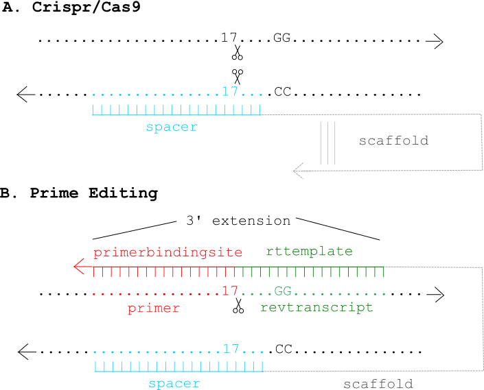
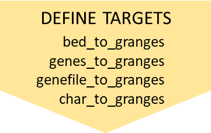
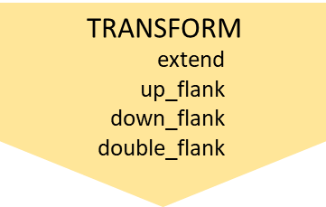

```{r, include=TRUE, echo=FALSE, message=FALSE}
knitr::opts_chunk$set(echo = TRUE, collapse = TRUE, cache = FALSE)
#str(knitr::opts_chunk$get())
```

<!--  -->

# Background

## Crispr/Cas9 and Prime Editing

**Crispr/Cas9** is a prokaryotic immune system turned into a genome engineering tool, with a Cas9/gRNA complex at the heart of its functioning. The **gRNA** (guide RNA) contains a 20 nucleotide (proto)**spacer** which guides the complex to a genomic locus with identical sequence, but only when followed by an *NGG* **PAM** (protospacer adjacent motif (see Figure 1A). The **Cas9** enzyme performs some effector action at that locus: *wildtype Cas9* cuts both strands after spacer nucleotide 17, *Cas9Nickase* cuts only a single strand (two variants exist, cutting respectively each of the strands), while catalytically dead *dCas9*, fused to some effector domain (KRAB, VPR, APEX) performs some alternative action (e.g. KRAB represses, VPR activates, APEX biotinylates). 

**Prime Editing** (Anzalone et al., 2019) extends this further, by coupling Cas9 to a Reverse Transcriptase (RT). As shown in Figure 1, the guide RNA is extended with a 3' extension that contains primer binding site (binding a complementary DNA region that acts as a primer for reverse transcription) and reverse transcription template (the template used for reverse transcription). The spacer still acts as targeting agent, guiding the Cas9/RT complex to targeted genomic locus.


```{r, fig.small = TRUE, echo = FALSE, fig.cap = 'gRNAs for Crispr/Cas9 (A) and Prime Editing'}

```


## Guide RNA design

**Guide RNA design** involves finding good guide RNAs to hit the targets of interest. Plasmids with guide RNA scaffolds, ready for cloning desired spacers into, can be readily ordered from AddGene. The actual task, therefore, boils down to finding good spacers for the targets of interest. For prime editing, it additionally involves finding appropriate primer binding site and reverse transcription template to edit the target site of interest. 

A **good spacer** needs to fulfill two requirements.

1. **Minimal off-target** (mis)matches, so that only intended targets are hit. 

    - Crispr gRNAs can hit exact (with identical and alternate NGG pam), as well as (up-to 2) mismatch offtargets.
    - Prime Editing is much more specific, hitting only exact offtargets.
  
2. **Maximal on-target** efficiency. Over the years, several sequence-to-efficiency prediction models have been developed, of which the Doench 2016 score has  currently become the community standard. The score is not perfect, and examples can be found where the prediction and the actual outcome differ. Yet, to-date it is the best heuristic to predict on-target efficiency, worth making use of.


# Multicrispr

Multicrispr was developed to make guide RNA design easier. As shown below, it contains functions to **define** and **transform** targets, **find spacers**,  compute/add  **offtarget counts** and **efficiency scores** (Doench 2016), and finally return all of this as a **GRanges** object.

```{r overview, fig.wide = TRUE, out.width = "80%", echo = FALSE }
knitr::include_graphics("../inst/extdata/readme_portrait.png")
```

## Install


Installing **multicrispr** is simple:

```{r, eval = FALSE}
url <- 'https://gitlab.gwdg.de/loosolab/software/multicrispr.git'
remotes::install_git(url, repos = BiocManager::repositories())
```


Doench et al. (2016) 's python package **azimuth** for on-target efficiency prediction using their method can be easily installed and activated using reticulate:

```{r, eval = FALSE}
# Install - run R(Studio) with admin privileges for this to work!
  reticulate::conda_create('azienv', 'python=2.7')
  reticulate::conda_install('azienv', 'azimuth', pip = TRUE)
  reticulate::conda_install('azienv', 'scikit-learn==0.17.1', pip = TRUE)
```
```{r}
# Activate
  reticulate::use_condaenv('azienv')
```


Bowtie-indexed genomes for quick offtarget analysis can be installed using `index_genome`. For the two genomes used in the examples, mm10 and hg38, the functions downloads pre-build indexes from our data server, allowing a quick exploration (set `download=FALSE` to build index anew):

```{r, eval = FALSE}
index_genome(BSgenome.Mmusculus.UCSC.mm10::BSgenome.Mmusculus.UCSC.mm10)
index_genome(BSgenome.Hsapiens.UCSC.hg38::BSgenome.Hsapiens.UCSC.hg38  )
```

<!-- 1. Install conda for python 2.7 -->
<!-- 2. Create a new conda environment: `conda create --name azimuthenv python=2.7` -->
<!-- 3. Activate conda environment:     `conda activate azimuthenv` -->
<!-- 4. Install module azimuth:         `pip install azimuth` -->
<!-- 5. Install scikit-learn:           `pip install scikit-learn==0.17.1` -->


```{r, echo = FALSE, results = FALSE, message=FALSE}
  # Not required
  # Done to load dependencies silently - keeping focus
  require(GenomicRanges)
  require(Biostrings)
  require(dplyr)
  require(dbplyr)
  require(htmltools)
  require(htmlwidgets)
```

## Define targets

```{r, fig.small = TRUE, out.width = "70%", echo = FALSE }

```

`bed_to_granges` converts a (0-based) BED coordinate file into a (1-based) GRanges.  
An example is loading the 1974 binding sites of the transcription factor SRF:

```{r}
require(magrittr)
require(multicrispr)
bedfile <- system.file('extdata/SRF.bed', package = 'multicrispr')
tfbs0 <- bed_to_granges(bedfile, genome = 'mm10')
```


`genes_to_granges` and `genefile_to_granges` convert entrez/ensembl gene identifiers into GRanges using `txdb` gene models. 
An example that loads of a small subset of the 1974 SRF binding sites:

```{r}
require(multicrispr)
entrezfile <- system.file('extdata/SRF.entrez', package = 'multicrispr')
txdb <- TxDb.Mmusculus.UCSC.mm10.knownGene::TxDb.Mmusculus.UCSC.mm10.knownGene
sometfbs0 <- genefile_to_granges(entrezfile, txdb, complement = TRUE)
```


`char_to_granges` uses a 1-based coordinate vector to specify the GRanges.  
It can be used to define four prime editing sites mentioned by Anzalone et al. (2019):

```{r, fig.width=3.5, fig.height=1.5}
# char_to_granges: Anzalone et al. (2019) prime editing targets
bsgenome <- BSgenome.Hsapiens.UCSC.hg38::BSgenome.Hsapiens.UCSC.hg38  
pe0 <- char_to_granges(c(HBB  = 'chr11:5227002:-'), bsgenome)
plot_intervals(pe0)
```

## Transform targets

```{r, fig.small = TRUE, out.width = "70%", echo = FALSE }

```

As a second step, the original targets may require transformation. The functions `extend`, `up_flank` (upstream flanks), `down_flank` (downstream flanks),  and `double_flank` (double flanks) can be used to update the target ranges as required.

```{r, fig.width=4, fig.height=2, out.width="65%"}
# Extend
targets <- pe0
invisible(extend(targets, -22, 22, plot = TRUE))
# Up flank
invisible(up_flank(  targets, -200, -1, plot = TRUE))
# Down flank
invisible(down_flank( targets, 1, 200, plot = TRUE))
# Double flank
invisible(double_flank(targets, -200, -1, +1, +200, plot = TRUE))
```


## Find spacers

```{r, fig.small = TRUE, out.width = "70%", echo = FALSE }

```

The next step is to find N20 spacers followed by NGG pam sites.
This can be done with `find_spacers`, after extending target range(s) to prime editing neighbourhood(s):

```{r, fig.width=3, fig.height=1.5}
bsgenome   <- BSgenome.Hsapiens.UCSC.hg38::BSgenome.Hsapiens.UCSC.hg38
neighbourhood <- extend_for_pe(targets, bsgenome)
spacers    <- find_spacers(neighbourhood, bsgenome, complement = FALSE)
```

For prime editing, however, it is better to use `find_pe_spacers`, which performs target to neighbourhood extension implicitly, and also adds 3' extension (Fig 1) to returned spacer GRanges.

```{r, fig.width=3.3, fig.height=1.7}
spacers <- find_pe_spacers(targets, bsgenome=bsgenome) 
```

This finds prime editing sites that follow Anzalone et al. (2019)'s recommended default settings: a 13-nucleotide primer and a 16-nucleotide reverse transcription template. These settings can be easily altered (e.g. Anzalone et al. report success with reverse transcription templates of up to 48 nucleotides) by: 

```{r, fig.width=3.6, fig.height=2.1}
spacers <- find_pe_spacers(targets, bsgenome=bsgenome, nrt = 48) 
```


## Add offtargets

```{r, fig.small = TRUE, out.width = "70%", echo = FALSE }

```

```{r, fig.width=3.6, fig.height=2.1}
if (has_been_indexed(bsgenome)){
  spacers %<>% add_offtargets(bsgenome, mismatch = 0, plot = TRUE)
}
```

## Add efficiency

```{r, fig.small = TRUE, out.width = "70%", echo = FALSE }
knitr::include_graphics("../inst/extdata/05_efficiency.png")
```

Not all N~20~NGG gRNA sequences target equally well (even when matching sequence perfectly). For each position in the 23-bp gRNA sequence, the  nucleotide present in current, previous and next position has an effect on targeting efficiency. The current community standard for on-target efficiency prediction is that of Doench et al. (2016), which can be computed and added with `add_efficiency`: 

```{r, fig.width=3.6, fig.height=2.1}
if (reticulate::py_module_available('azimuth')){
  spacers %<>% add_efficiency(bsgenome, 'Doench2016')
}
```

## Return spacer GRanges

```{r}
  spacers
```

# References {-}

Anzalone, A.V., Randolph, P.B., Davis, J.R. et al. Search-and-replace genome editing without double-strand breaks or donor DNA. Nature 576, 149–157 (2019). https://doi.org/10.1038/s41586-019-1711-4

Doench et al. (2016). Optimized sgRNA design to maximize activity and minimize off-target effects of CRISPR-Cas9. Nature Biotechnology, 34(7), doi:10.1038/nbt.3437


